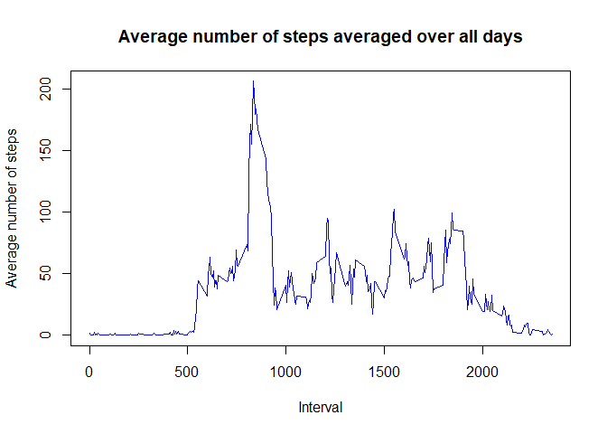

# Reproducible Research: Peer Assessment 1


## Loading and preprocessing the data

Show any code that is needed to:
1. Load the data via read.csv
2. Process/transform the data (if necessary) into a format suitable for your analysis.


```r
## Initial Setup
setwd("C:/Users/antic/RepData_PeerAssessment1")

## load libraries
library(plyr)
```

```
## Warning: package 'plyr' was built under R version 3.4.2
```

```r
library(ggplot2)
```

```
## Warning: package 'ggplot2' was built under R version 3.4.2
```

```r
## Downloading and unzipping the dataset
fileURL <- "https://d396qusza40orc.cloudfront.net/repdata%2Fdata%2Factivity.zip"
if(!file.exists("./data")){
  dir.create ("./data")}
zipfileName <- "./data/repdata_data_activity.zip"
download.file(fileURL, zipfileName)

unzip(zipfileName, exdir="./data")

## Prepare the dataset to only leverage February 1st and 2nd 2007
activityDF <- read.csv("./data/activity.csv", header= T, as.is=TRUE)
```
## What is mean total number of steps taken per day?

For this part of the assigment, I've ignored the NA values in the dataset.

1.  Make a histogram of the total number ofsteps taken each day
2.  Calculate and report the mean and median total number of steps taken per day.
3. Calculate and report the mean and median of the total number of steps per day.


```r
##create a dataframe ignoring NA cases
activitywoNA_DF <- na.omit(activityDF)
stepsbyDate_Table <- aggregate(steps ~ date, activitywoNA_DF, sum)

#create histogram of the total number of steps in a day
hist(stepsbyDate_Table$steps, col=1, main="Histograme of total number of steps per day", xlab = "Total number of steps in a day")
```

<!-- -->

```r
#get the mean and media for total number of steps per day
stepsMean <- mean(stepsbyDate_Table$steps)

stepsMedian <- median(stepsbyDate_Table$steps)
```

The mean of the total steps per day is 1.0766189\times 10^{4}.
The median of the total steps per day is 10765.


## What is the average daily activity pattern?

1. Make a time series plot (i.e. ) of the 5-minute interval (x-axis) and the average number of steps taken, averaged across all days (y-axis)
2. Which 5-minute interval, on average across all the days in the dataset, contains the maximum number of steps?


```r
##Determine average number of steps in an intervale across all days
stepsintervalTable <- ddply(activitywoNA_DF, .(interval), summarise, steps=mean(steps))

##Depict which 5 minute intervanl across alld ays contains the max steps
plot(stepsintervalTable$interval, stepsintervalTable$steps, type="l",col="blue", main="Average number of steps averaged over all days", xlab="Interval", ylab="Average number of steps")
```

<!-- -->

```r
##find row id of maximum average number of steps in an interval
maxAverageStepsRowID <-stepsintervalTable[which.max(stepsintervalTable$steps),]
```
The interval, 835, 206.1698113 has the maximum average steps

## Imputing missing values
Note that there are a number of days/intervals where there are missing values (coded as ). The presence of missing days may introduce bias into some calculations or summaries of the data.

1. Calculate and report the total number of missing values in the dataset (i.e. the total number of rows with s)
2. Devise a strategy for filling in all of the missing values in the dataset. The strategy does not need to be sophisticated. For example, you could use the mean/median for that day, or the mean for that 5-minute interval, etc.
3. Create a new dataset that is equal to the original dataset but with the missing data filled in.
4. Make a histogram of the total number of steps taken each day and Calculate and report the mean and median total number of steps taken per day. Do these values differ from the estimates from the first part of the assignment? What is the impact of imputing missing data on the estimates of the total daily number of steps?


```r
##obtain rows with NAs
imputed <- activityDF[!complete.cases(activityDF),]

for (i in 1:nrow(imputed)){
    if (is.na(imputed$steps[i])){
        imputed$steps[i] <- stepsintervalTable$steps[which(imputed$interval[i] == stepsintervalTable$interval)]}
}

imputed <- arrange(imputed, interval)

## aggregate steps as per date to get total number of steps in a day
table_date_steps_imputed <- aggregate(steps ~ date, activityDF, sum)

## create histogram of total number of steps in a day
hist(table_date_steps_imputed$steps, col=1, main="(Imputed) Histogram of total number of steps per day", xlab="Total number of steps in a day")
```

<!-- -->

```r
## get mean and median of total number of steps per day
mean(table_date_steps_imputed$steps)
```

```
## [1] 10766.19
```

```r
median(table_date_steps_imputed$steps)
```

```
## [1] 10765
```

```r
## get mean and median of total number of steps per day for data with NA's removed
mean(stepsintervalTable$steps)
```

```
## [1] 37.3826
```

```r
median(stepsintervalTable$steps)
```

```
## [1] 34.11321
```

## Are there differences in activity patterns between weekdays and weekends?

For this part the  function may be of some help here. Use the dataset with the filled-in missing values for this part.

1.  Create a new factor variable in the dataset with two levels - "weekday" and "weekend" indicating whether a given date is a weekday or weekend day.
2.  Make a panel plot containing a time series plot (i.e. ) of the 5-minute interval (x-axis) and the average number of steps taken, averaged across all weekday days or weekend days (y-axis). See the README file in the GitHub repository to see an example of what this plot should look like using simulated data.


```r
## convert date from string to Date class
activityDF$date <- as.Date(activityDF$date, "%Y-%m-%d")

##add a new column indicating day of the week 
activityDF$day <- weekdays(activityDF$date)

##add a new column called day type and initialize to weekday
activityDF$day_type <- c("weekday")

## If day is Saturday or Sunday, make day_type as weekend
for (i in 1:nrow(activityDF)){
  if (activityDF$day[i] == "Saturday" || activityDF$day[i] == "Sunday"){
    activityDF$day_type[i] <- "weekend"
  }
}

## convert day_time from character to factor
activityDF$day_type <- as.factor(activityDF$day_type)

## aggregate steps as interval to get average number of steps in an interval across all days
table_interval_steps_imputed <- aggregate(steps ~ interval+day_type, activityDF, mean)


## 
## Attaching package: 'ggplot2'
## 
## The following object is masked from 'package:psych':
## 
##     %+%
qplot(interval, steps, data=table_interval_steps_imputed, geom=c("line"), xlab="Interval", 
      ylab="Number of steps", main="") + facet_wrap(~ day_type, ncol=1)
```

<!-- -->
